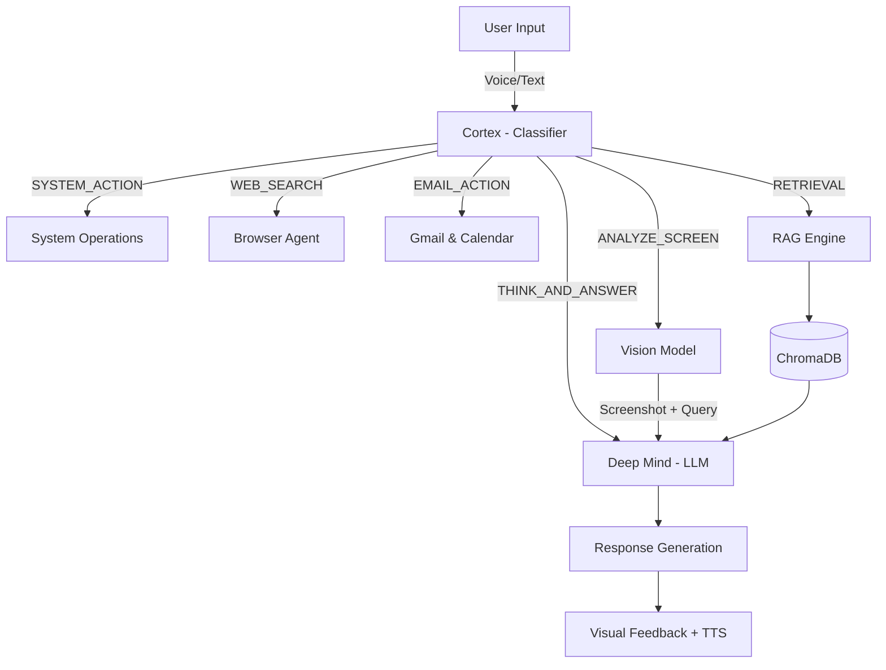

<div align="center">

# J.A.R.V.I.S.
### Just A Rather Very Intelligent System


**Next-Generation Personal Assistant with Neural Interface, Vision & Email Intelligence**

</div>

---

## 🚀 Overview

**J.A.R.V.I.S.** is a modular, AI-powered personal assistant that automates tasks, retains knowledge, answers complex queries, and interacts via a futuristic GUI. It uses a **"Three-Stage Brain"** architecture combined with multimodal vision and real-time Google integration.

> *"I am not just a program. I am a system designed to evolve."*

---

## 🧠 Architecture



### 1. The Cortex (Classifier)
Uses **Meta-Llama-3-8B-Instruct** to instantly classify your intent into one of:
`SYSTEM_ACTION` · `WEB_SEARCH` · `THINK_AND_ANSWER` · `OFFICE_ACTION`
`MEETING_MODE` · `MEMORY_ACTION` · `AUTOMATION_ACTION` · `ANALYZE_SCREEN` · `EMAIL_ACTION`

### 2. The Deep Mind (Reasoner)
Uses **Meta-Llama-3.3-70B-Instruct** for deep reasoning, code generation, and summarization. Has access to the RAG system for current events.

### 3. Vision Engine *(New)*
Uses **Meta-Llama-3.2-11B-Vision-Instruct** to analyze screenshots. Ask Jarvis *"What's on my screen?"* and it takes a screenshot, analyzes it, and responds.

### 4. Gmail & Calendar Engine *(New)*
OAuth2-authenticated connection to your Google account. Reads emails, searches them, and manages calendar events — all by voice.

### 5. The Knowledge Base (RAG System)
A ChromaDB-backed RAG pipeline that fetches and embeds daily news from global RSS feeds for grounded, hallucination-free answers.

---

## ✨ Features

### 🤖 Core Intelligence
- **🗣️ Wake-Word Voice Input** — Only activates on *"Hey Jarvis"* / *"Jarvis"*
- **🔁 Continuous Conversation** — Automatically resumes listening after responding
- **🧠 Contextual Memory** — Remembers preferences & facts across a session
- **📚 Daily News RAG** — Auto-updates with global news every morning

### 👁️ Vision *(New)*
- **"What's on my screen?"** — Jarvis takes a screenshot and analyzes it
- **"Explain this error on my screen"** — Get instant code/error explanations
- **"Describe this image"** — Works with anything visible on your display

### 📧 Gmail & Google Calendar *(New)*
- **"Read my emails"** — Fetches & narrates your unread inbox
- **"Find emails from John"** — NLP-powered email search
- **"What's on my calendar?"** — Lists upcoming events
- **"Schedule a meeting tomorrow at 3 PM"** — Creates calendar events by voice

### 💻 System Control
- *"Turn up the volume"* · *"Open Calculator"* · *"Mute audio"*
- *"Connect to HomeWiFi"* · *"Lock my PC"* · *"Check system health"*

### 🌐 Web Automation
- **Autonomous Browsing** — Google Search via Selenium
- **Content Extraction** — Reads & summarizes top results

### 📄 Office Automation
- Create **Word documents** and **PowerPoint presentations** by voice

### 🎨 Visual Interface
- **Cyberpunk UI** — Dark/Cyan aesthetics with `customtkinter`
- **Floating Overlay** — Animated orb switches between IDLE / LISTENING / SPEAKING
- **Emotion-Mapped TTS** — Edge-TTS voice with rate/pitch modulated by detected emotion

---

## 🛠️ Installation

### Prerequisites
- Python 3.10+
- [Git](https://git-scm.com/)

### 1. Clone the Repository
```bash
git clone https://github.com/kiruthik04/Jarvis.git
cd Jarvis
```

### 2. Set up Virtual Environment
```bash
python -m venv venv
# Windows
./venv/Scripts/Activate.ps1
# Mac/Linux
source venv/bin/activate
```

### 3. Install Dependencies
```bash
pip install -r requirements.txt
pip install -r jarvis_news_system/requirements.txt
```

### 4. Configure Environment
Rename `.env.example` to `.env` and add your token:
```ini
HUGGINGFACE_API_TOKEN=hf_your_token_here
```

### 5. Gmail & Calendar Setup *(Optional)*
1. Go to [console.cloud.google.com](https://console.cloud.google.com)
2. Create a project → Enable **Gmail API** and **Google Calendar API**
3. Create **OAuth 2.0 Client ID** (Desktop App type)
4. Download as `credentials.json` and place it in the project root
5. Add your email as a **Test User** in the OAuth consent screen
6. On first run, a browser will open for one-time Google sign-in

> **Security:** `credentials.json` and `token.json` are gitignored and never committed.

---

## ⏯️ Usage

### Run Jarvis
```bash
python main.py
```

### Manage the Knowledge Base
```bash
# Manual update
python -m jarvis_news_system.main run-now

# Daily scheduler
python -m jarvis_news_system.main schedule
```

### Voice Commands to Try
| Command | Action |
|---|---|
| *"Hey Jarvis, what time is it?"* | General knowledge |
| *"Jarvis, what's on my screen?"* | Screen vision analysis |
| *"Jarvis, read my emails"* | Gmail inbox summary |
| *"Jarvis, schedule a standup tomorrow at 10 AM"* | Create calendar event |
| *"Jarvis, open VS Code"* | App launcher |
| *"Jarvis, write a report about AI trends"* | Word document creation |
| *"Jarvis, what's the latest in AI news?"* | RAG-powered news retrieval |

---

## 📂 Project Structure

```
Jarvis/
├── src/
│   ├── actions/
│   │   ├── system_ops.py     # OS control (volume, apps, wifi, power)
│   │   ├── browser.py        # Selenium web automation
│   │   ├── gmail.py          # Gmail & Google Calendar (NEW)
│   │   ├── voice_input.py    # Wake-word listener ("Hey Jarvis")
│   │   ├── voice_manager.py  # Edge-TTS + Pygame playback
│   │   ├── office.py         # Word & PowerPoint generation
│   │   ├── automation.py     # Reminders & scheduled tasks
│   │   └── listener.py       # Meeting transcription mode
│   ├── brain/
│   │   ├── classifier.py     # Intent classification (Llama-3-8B)
│   │   ├── llm.py            # Reasoning + Vision (Llama-3.3-70B, Llama-3.2-Vision)
│   │   ├── memory.py         # SQLite-backed persistent memory
│   │   ├── agent.py          # Code generation & execution agent
│   │   └── prompts.py        # All system prompts
│   ├── ui/
│   │   ├── interface.py      # Main GUI & pipeline orchestrator
│   │   ├── overlay.py        # Floating orb overlay
│   │   └── animation.py      # Listening indicator
│   └── config.py             # Global settings
├── jarvis_news_system/        # RAG Subsystem
│   ├── ingestion/             # RSS fetchers
│   ├── processing/            # Summarizers
│   ├── embeddings/            # Vector generation
│   ├── vector_store/          # ChromaDB
│   └── retrieval/             # RAG logic
├── credentials.json           # Google OAuth (gitignored)
├── main.py                    # Entry point
└── requirements.txt
```

---

<div align="center">
    <sub>Built with ❤️ by Kiruthik varshan</sub>
</div>
